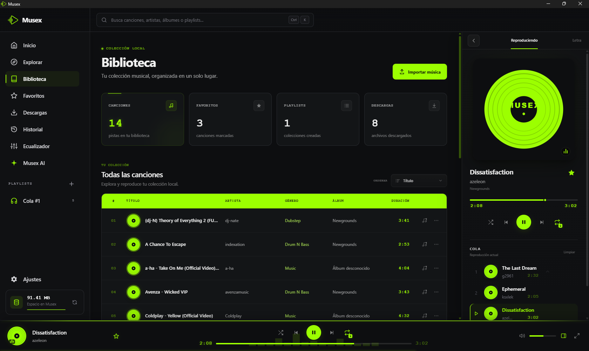

  

  <h1>Musex</h1>

  

    Un espacio de trabajo musical local construido con Angular, Tauri y Rust.
  

  

---

## Acerca de

Musex es un espacio de trabajo musical de escritorio enfocado en la gestión, reproducción y descubrimiento de música local.

## Tecnologías

* Angular
* Tauri
* Rust
* TypeScript
* Tailwind CSS

## Configuración recomendada del entorno

[VS Code](https://code.visualstudio.com/) + [Tauri](https://marketplace.visualstudio.com/items?itemName=tauri-apps.tauri-vscode) + [rust-analyzer](https://marketplace.visualstudio.com/items?itemName=rust-lang.rust-analyzer) + [Angular Language Service](https://marketplace.visualstudio.com/items?itemName=Angular.ng-template)